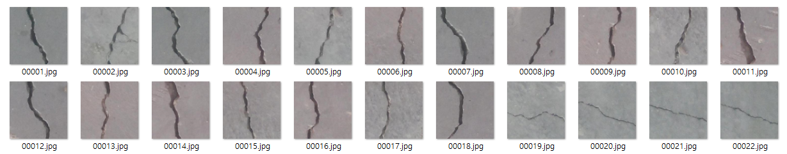
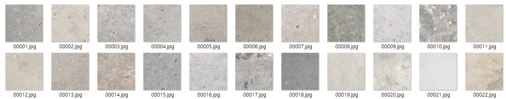

# concrete_crack_detection

### 실습 진행 환경
|구분|스펙|
|---|---|
|OS|Windows 11 Pro|
|Core|12th Gen Intel(R) Core(TM) i5-12400f 2.50 GHz|
|RAM|32.0GB|
|Graphic|NVIDIA GeForce RTX 3060|

### 실습 데이터
2018 – Özgenel, Ç.F., Gönenç Sorguç, A. “Performance Comparison of Pretrained Convolutional Neural Networks on Crack Detection in Buildings”, ISARC 2018, Berlin. \
튀르키예 METU Campus Building에서 수집

### 실습 이미지 예시
Positive img \

Negative img \

### 실습 내용
- 이미지 사이즈를 각각 32x32, 64x64, 128x128로 조정
- 훈련 데이터는 28,800개, 검증 데이터 3,200개, 테스트 데이터 8,000개의 데이터로 구성
- ResNet50, ResNet50 + VGGNet 결합 모델 및 imagenet의 pretrain된 모델 사용

### 실습 결과 - Confusion Matrix
- ResNet50
    |32x32|Negative|Positive|
    |---|---|---|
    |Negative|3963|15|
    |Positive|40|3982|
  
    |64x64|Negative|Positive|
    |---|---|---|
    |Negative|3971|7|
    |Positive|5|4017|
     
    |128x128|Negative|Positive|
    |---|---|---|
    |Negative|1962|36|
    |Positive|14|1988|
- ResNet50 + VGGNet
    |32x32|Negative|Positive|
    |---|---|---|
    |Negative|3963|15|
    |Positive|40|3982|
    
    |64x64|Negative|Positive|
    |---|---|---|
    |Negative|3971|7|
    |Positive|5|4017|
    
    |128x128|Negative|Positive|
    |---|---|---|
    |Negative|1994|4|
    |Positive|4|1998|

### 결론
- ResNet50 모델을 단독으로 사용하였을 때 최소 97.5% 이상의 정확도 기록
- ResNet50 + VGGNet16을 결합한 모델은 99.3% 이상의 정확도를 기록
    - 혼합 모델을 사용한다면 더 높은 정확도를 기대할 수 있을 것으로 사료됨
- 다만 20,000장 씩 동일한 사이즈로 전처리 된 이미지를 사용했기 때문에 실무에서는 위와 같은 정확도를 얻기 위해 세심한 전처리가 필요할 것으로 생각됨됨
